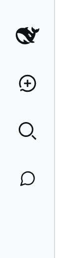

# dsh-session-rail

A rail chat switcher for the [DeepSeek Harness](https://github.com/deepseek-ai/deepseek-harness) web client: one icon under **New session** opens a searchable flyout of your workspaces and their recent sessions, so switching chats never needs the sidebar expanded.


The collapsed rail becomes: brand, **New session**, **Search**, **Chats**, then the pinned foot.



## What it does

- **It is a flat list, always open**: the three most recently used workspaces, each with up to four of its most recent sessions. There are no disclosure rows to expand or collapse — hover a row and it is already there.
- **No scrollbars, in either direction.** The content is capped to fit, and the panel draws no scrollbar chrome; on a very short window the list scrolls with the wheel instead of showing a bar.
- **The panel's height is frozen when it opens**, so a session list refresh never drags its edge away from your pointer.
- **It closes only when you clearly leave** — more than 24 px outside the row and the panel for longer than 420 ms — and the close plays a short exit animation. Re-entering cancels it.
- **Rows carry the sidebar's statuses**: waiting for an answer, running, completed, and the active-Schedule marker.
- **Search runs the host's content index** next to local title matching, with snippets, debounced and cancelled like the sidebar's own search.
- **A workspace row offers "new session in this workspace"**, and a session row offers fork, rename and archive on hover.
- **The chat list is a `tree`**: arrows move, Enter opens, Escape closes, and the search box hands focus to the list on ArrowDown.
- The row exists **only while the rail is collapsed**. A wide sidebar keeps the standard Workspaces browser and its **Add workspace** action untouched.

Collapsed sessions stay hidden, matching the sidebar itself: subagent origins, archived sessions, and the provisional blank New session row.

## Install

```sh
dsh plugin --profile web add dsh-session-rail
```

The package ships its own bundle patch, so the command also adds it to the profile's layer stack — there is no `cordis.patch.yml` edit to make. Reload the page afterwards: the browser boot graph is composed when the page is served.

To remove it:

```sh
dsh plugin --profile web remove dsh-session-rail
```

## Content search is opt-in in DSH

The shipped `web` profile configures the session-query index with `openAt: never`, which disables full-text search deployment-wide — the sidebar's own search says "Content search is temporarily unavailable" for the same reason. This plugin does not change that default. To get content matches and snippets in the flyout, enable the index in your profile patch (`~/.dsh/profiles/web/cordis.patch.yml`):

```yaml
- id: session-query-sqlite
  config:
    path: ':memory:'
    openAt: first-search
```

Without it, the flyout still filters by session and project names and tells you that content search is unavailable.

## Requirements

- DeepSeek Harness `0.1.5-rc.1` or `0.1.6-alpha.1` (both verified end to end).
- Node 22 or newer, for the `dsh` CLI itself.
- No runtime dependencies: the browser half is one hand-written client-module bundle and requires only platform-seeded modules (`react`, `react-dom`, `@deepseek-ai/dsh-client-ui-primitives`).

## Configuration

Everything lives in the constants above the stylesheet in `lib/client.js`:

| Constant | Default | Meaning |
|---|---:|---|
| `MAX_PROJECTS` | 3 | Workspaces listed, most recently used first |
| `MAX_CHATS` | 4 | Sessions listed per workspace, most recent first |
| `HOVER_OPEN_MS` | 160 | Hover delay before the flyout opens |
| `HOVER_CLOSE_MS` | 420 | Grace period before a pointer that left closes it |
| `CLOSE_MARGIN` | 24 | How far outside the row and panel still counts as inside |
| `SEARCH_DEBOUNCE_MS` | 250 | Debounce before the host content search runs |

## How it works

- The list is shaped once per render: sessions are grouped by the workspace registry, each group sorted by its newest session, groups sorted against each other the same way and cut to `MAX_PROJECTS`, and each group cut to `MAX_CHATS`. The synthetic "No project" group competes for a slot like any other.
- No scrollbars are drawn: the list hides its scrollbar (`scrollbar-width: none`, plus `::-webkit-scrollbar`), clips horizontal overflow, and its rows are `box-sizing: border-box`, which is what makes a `width: 100%` row with padding actually fit.
- The row is registered into `sidebar.panellist`, the global-panel icon list the sidebar shell renders directly under **New session**, and only while `[data-sidebar-collapsed]` is present — so the expanded sidebar is exactly the shipped one.
- The shell renders that list *before* the Workspaces region, so the requested order (Search above Chats) is a flex `order` swap: the region stops growing, the foot keeps the free space, and the row lands between them. The region's header row, which holds **Add workspace**, is hidden in the rail.
- The row button belongs to the shell and calls `selectPanel` on click, so the plugin owns it with a native listener that runs before React's root dispatch. The full-width `main` panel stays registered only so that nothing can throw.
- Everything is found structurally (`data-slot`, sibling order, the action group that does not contain the Search button) rather than by class name or localized label, and every rail adjustment is undone when the sidebar expands. A reshuffled shell degrades to the default order instead of breaking.

## Development

The dev tools need a `dsh` binary (`DSH_BIN`, default `dsh`), the `zstd` CLI, `playwright-core` (`PLAYWRIGHT_CORE`) and a Chromium binary (`CHROMIUM`, default `/usr/bin/chromium`).

```sh
npm run check       # parses every source, validates the manifest and dictionaries
node tools/smoke.mjs       # browser suite against a fictional DSH_HOME
node tools/screenshots.mjs # rebuilds docs/*.png and fails on any leaked real data
```

`tools/fixture-home.mjs` builds the fictional home the last two use: three invented workspaces (`acme-web`, `orion-api`, `design-system`) whose sessions are generated by `dsh --profile headless` from invented prompts, then retitled and spread over a plausible history. Mutating checks (fork, rename, archive, new session) run only there, never against your own `DSH_HOME`.

## License

MIT — see [LICENSE](LICENSE).
