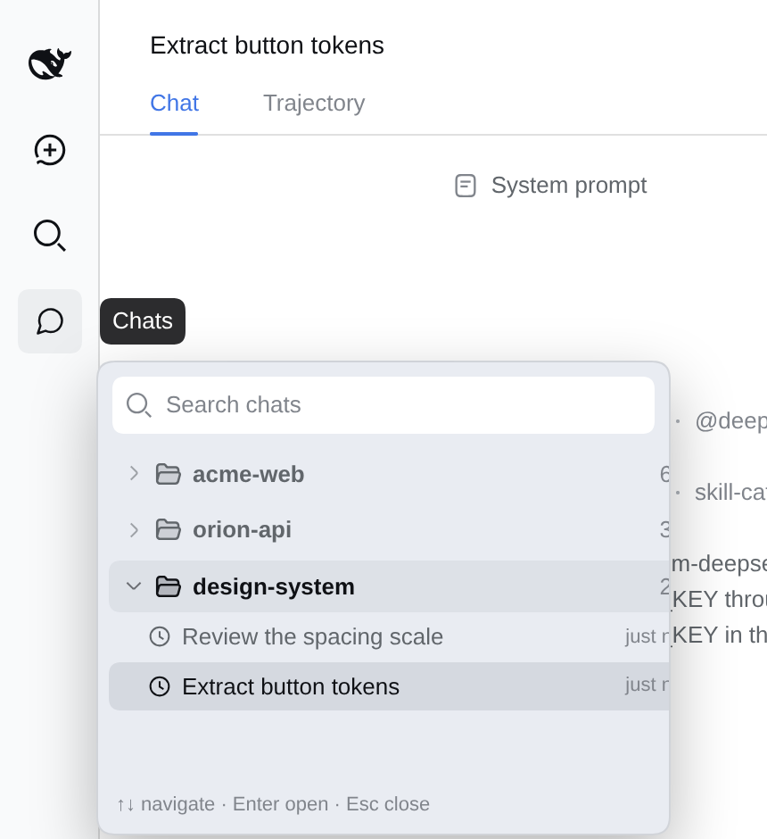

# dsh-session-rail

Плагин для DeepSeek Harness Web: открывает flyout со списком рабочих пространств и недавних сессий, чтобы быстро переключаться между чатами.



## Установка

Из npm:

```sh
dsh plugin --profile web add dsh-session-rail
```

Из GitHub:

```sh
dsh plugin --profile web add https://github.com/Iwwww/dsh-session-rail
```

После установки перезагрузите страницу.

## Разработка

Инструменты разработки отделены от runtime-зависимостей плагина и не устанавливаются его пользователям. Для браузерных тестов и создания скриншотов нужны DSH CLI, `zstd`, `playwright-core` и Chromium. Статические проверки запускаются командой `npm run check`, браузерный smoke-тест — `node tools/smoke.mjs`.
